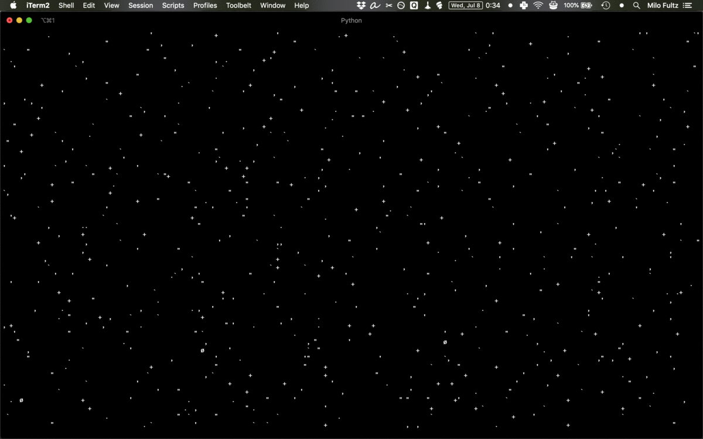

# Star Maker
---

star_maker is a lo-fi screen saver and ambient visual using blessed. I originally made it so I could make a star visual for [a page on my website](https://more.milofultz.com/2020/07/07/spacelove) and then mucked around and realized it offered me both a chance to mess around with [blessed](https://github.com/jquast/blessed) and a really funny challenge.

# Future Implementation
---
- Sideways motion instead of top to bottom
- ~~Parallax effect: for every multiple of 3, every line n+1 doesn't change at all, every line n+2 moves by 1px, every line n+2 moves by 2px~~
- ~~Different colors, particularly for the special characters to be more like planets or suns. I'm thinking like the [Hubble ultra deep field picture](https://www.nasa.gov/audience/forstudents/k-4/stories/nasa-knows/what-is-the-hubble-space-telecope-k4.html)~~
- ~~Cooler characters, if I find some~~